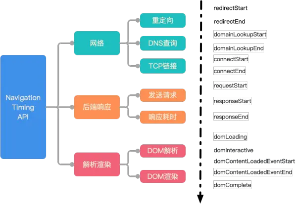

# 0301

## 白屏时间

Performance时间图



三个重要的时间


### 首字节时间

**首字节时间 = reponseStart - fetchStart**

同浏览器标记TTFB（Time to first byte）时间


### 白屏时间

**白屏时间 = domInteractive - fetchStart**

PS.也可以取domLoading时间，因为loading解析DOM树，第一个元素很快会出现


### 首屏时间

1. 考虑页面是有有ajax请求（监听请求后300ms作为稳定节点）
2. 考虑页面是否有图片（收集首屏内图片信息，定时查询performance.getEntries()确定图片最后加载时间）

有图片时（首屏时间 = 首屏内的图片时间 - NavigationStart）
无图片时（首屏时间 = 最后DOM更新时间 - NavigationStart）


## 算法题1

有一个数组和一个值，需要求大于等于该值的最小长度，例如[2, 3, 4, 7]和5，那么最小就是1，因为7大于5 如果数字是8，那么最小就是2, 因为4 + 7大于8

``` javascript
function solution(array, num) {
    array.sort((a, b) => a - b)
    for (let i = array.length - 1, cnt = 0; i >= 0; i--) {
        cnt += array[i]
        if (num < cnt) {
            return (array.length - i)
        }
    }
    return array.length
}

// Test case
console.assert(solution([], 3) === 0, 'case1')
console.assert(solution([3], 3) === 1, 'case2)
console.assert(solution([1, 4], 5) === 2, 'case3')
console.assert(solution([2, 3, 4, 7], 5) === 1, 'case4')
console.assert(solution([2, 3, 4, 7], 8) === 2, 'case5')
```


### 算法题2

第二道算法题 有序数组中小于某个数的个数，例如  
[1, 2, 3, 4]  
2  
// 1  

``` javascript

```