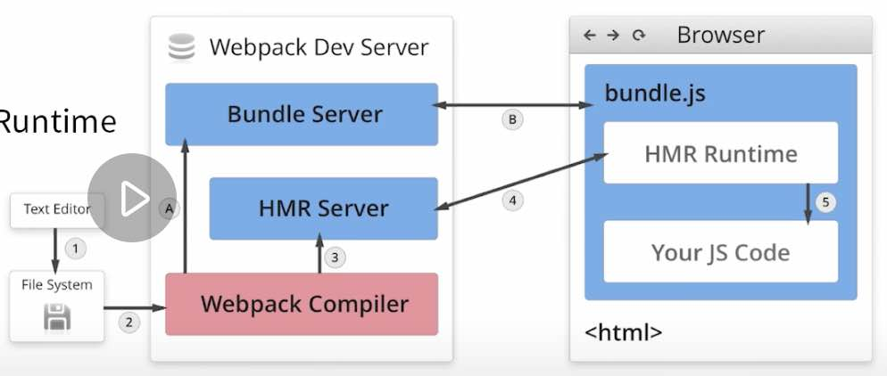

### loader plugin 区别

loader   
背景：webpack 只支持 JS、JSON 两种类型  
- 通过 loader 支持其他文件类型并转化为有效的模块  
- 可添加模块到依赖图中  
本身是一个函数，接受源文件作为入参、转换结果作为出参  

常见 loader  
- babel-loader
- css-loader
- less-loader
- ts-loader
- file-loader
- raw-loader
- thread-loader

使用：
``` javascript
rule: [
    {
        // 正则指明匹配规则
        test: /\.less$/,
        // 指明使用的 loader，链式执行，从右到左的顺序
        use: [
            'style-loader', // 样式作为 style
            'css-loader',   // 解析 css
            'less-loader',  // 解析 less
        ]
    }
]
```

plugin 插件  
- 用于 bundle 文件的优化，资源管理和环境变量的注入
- 作用于整个构建过程

常见 plugin   
- commmonsChunkPlugin
- cleanWebpackPlugin
- ExtraTextWebpackPlugin （将 CSS 从 bundle 提取成一个独立的 CSS）
- CopyWebpackPlugin
- HtmlWebpackPlugin （创建 html 承载输出的bundle）
- UglifyjsWebpackPlugin
- ZipWebpackPlugin
- MiniCssExtractPlugin (抽取module中抽取 CSS 成独立文件，使用时配合 插件提供放入loader、与 style-loader 互斥)


### webpack HMR



包含以下内容：  
- Webpack Compile // 将 JS 编译成 Bundle
- HMR Server      // 将更新文件输出给 HMR Runtime
- Bundle Server // 提供 Bundle 的服务
- HMR Runtime   // 会被注入到浏览器，更新文件变化
- Bundle.js     // 构建输出的文件

PS1.  
这里面的热更新有最核心的是 HMR Server 和 HMR runtime。

HMR Server 是服务端，用来将变化的 js 模块通过 websocket 的消息通知给浏览器端。

HMR Runtime是浏览器端，用于接受 HMR Server 传递的模块数据，浏览器端可以看到 .hot-update.json 的文件过来。

PS2.  
老师HotModuleReplacementPlugin是做什么用的？

webpack 构建出来的 bundle.js 本身是不具备热更新的能力的，HotModuleReplacementPlugin 的作用就是将 HMR runtime 注入到 bundle.js，使得bundle.js可以和HMR server建立websocket的通信连接


### 文件指纹设置

chunkhash  
和 webpack 打包的 chunk 有关，  
不同的 entry 生成不同的 chunkhash值

contenthash  
根据文件内容来改变，  
文件内容不变则 contenthash 值不变

PS. 文件类的使用 hash  
[name][hash:8].[ext]

``` javascript
output: {
    filename: '[name][chunkhash:8].js',
    path: __dirname + '/dist',
}
plugins: [
    new MiniCssExtractPlugin({
        filename: '[name][contenthash:8].css'
    })
]
```


### 基本文件压缩

- js webpack4 的 production 模式默认开启 js 压缩
- css OptimizeCSSAssetsPlugin  
``` javascript
new OptimizeCSSAssetsPlugin({
    assetsNameRegExp: /\.css$/g,
    cssProcessor: require('cssnamo'),
})
```
- html HtmlWebpackPlugin  
``` javascript
new HtmlWebpackPlugin({
    template: path.join(__dirname, 'src/search.html'),
    filename: 'search.html',
    chunks: ['search'],
    inject: true,     // 将 chunk 文件注入到 html 中来
    minify: {
        html5: true,
        collaspseWhitespace: true,
        preserveLineBreaks: false,
        minifyCSS: true,
        minifyJS: true,
        removeComments: true
    }
})
```

### bundle、chunk、module 概念

bundle：打包最终生成的文件
chunk：每个chunk是由多个module组成，可以通过代码分割成多个chunk。
module：webpack中的模块（js、css、图片等等）